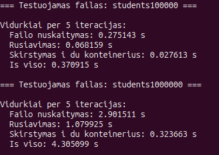
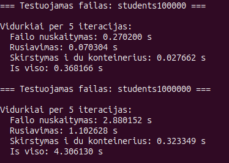
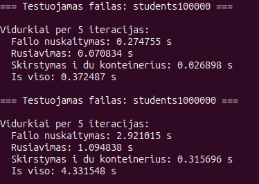
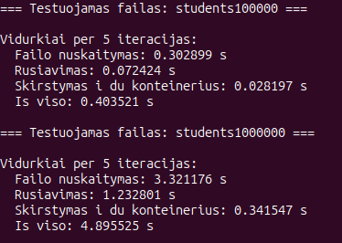
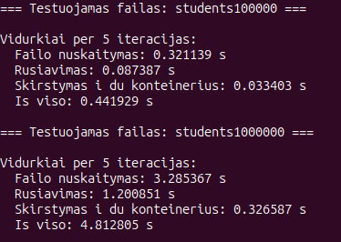
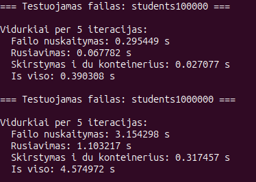

# Studentų valdymo programa

Tai C++17 projektas studentų duomenims nuskaityti, generuoti, rūšiuoti, skaidyti į dvi grupes ir išvesti į ekraną arba į failą. Programa palaiko kelis konteinerių tipus: `vector`, `list` ir `deque`.

## Funkcionalumas

- studentų įrašų nuskaitymas iš failo
- studentų kūrimas rankiniu būdu arba generuojant atsitiktinius duomenis
- galutinio pažymio skaičiavimas pagal vidurkį arba medianą
- studentų rūšiavimas pagal vardą, pavardę arba galutinį pažymį
- studentų skaidymas į `nuskriausti` ir `protingi`
- rezultatų išvedimas į ekraną arba į tekstinį failą
- testai didelėms duomenų imtims ir skirtingiems konteineriams

## Sistemos specifikacijos

Projektas buvo testuotas šioje aplinkoje:

| Paskirtis | Reikšmė |
| --- | --- |
| Operacinė sistema | Ubuntu 24.04.4 LTS |
| Branduolys | 6.17.0-20-generic |
| Kompiliatorius | g++ 13.3.0 |
| C++ standartas | C++17 |
| Procesorius | Intel Core i5-1035G1 @ 1.00 GHz |
| Operatyvioji atmintis | 7.3 GiB |
| Saugykla | SAMSUNG MZALQ256HAJD-000L2 NVMe SSD, 238.5 GB |

## Reikalavimai

- `g++` su C++17 palaikymu
- `make`

Greita patikra Linux aplinkoje:

```bash
g++ --version
make --version
```

## Kompiliavimas

1. Pereikite į projekto aplanką.
2. Surinkite programą su `make`.

```bash
cd /home/mantrimas/Documents/OOP/objektinis-programavimas
make
```

Tai sukuria vykdomąjį failą `student-vector`.

## Paleidimas

Paleiskite programą:

```bash
./student-vector
```

Išvalymas (jei reikia pilno perkompiliavimo):

```bash
make clean
```

Pilnas perkompiliavimas:

```bash
make clean && make
```

## Kaip paleisti našumo testus

Interaktyviame meniu pasirinkite:

1. `8 - Testuoti studentu skirstyma i nuskriaustus ir protingus`
2. Konteinerį:
	`1 - vector<Student>`
	`2 - list<Student>`
	`3 - deque<Student>`
3. Strategiją:
	`1 - Pirma`
	`2 - Antra`
	`3 - Trecia`

Testai paleidžiami failams:

- `students1000`
- `students10000`
- `students100000`
- `students1000000`
- `students10000000`

Programa pateikia laikus šioms dalims:

- failo nuskaitymas
- rūšiavimas
- skirstymas į `nuskriausti` ir `protingi`
- bendras laikas

## `Student` klasė: Rule of Five ir operatoriai

`Student` klasė paveldi abstrakčią bazinę klasę `Human` (failas `include/human.h`).

`Human` klasė apibrėžia:

- bendrus laukus `name_` ir `surname_`
- bendrus metodus `name()`, `surname()`, `setName(...)`, `setSurname(...)`
- virtualų destruktorių `virtual ~Human() = 0`, kuris leidžia saugiai naudoti polimorfizmą

Taip `Student` klasėje nelieka dubliuojamų vardo ir pavardės laukų, o paveldėti metodai naudojami tiesiogiai visame projekte.

`Student` klasėje (failas `include/student.h`) yra realizuoti šie Rule of Five metodai:

- kopijavimo konstruktorius `Student(const Student& other)`
- perkėlimo konstruktorius `Student(Student&& other) noexcept`
- kopijavimo priskyrimo operatorius `Student& operator=(const Student& other)`
- perkėlimo priskyrimo operatorius `Student& operator=(Student&& other) noexcept`
- destruktorius `~Student()`

Papildomai realizuoti įvedimo/išvedimo operatoriai:

- `operator>>(std::istream&, Student&)`:
  - nuskaito vieną eilutę formatu `Vardas Pavardė ND... Egzaminas`
  - paskutinis skaičius laikomas egzamino pažymiu
  - tikrina pažymių intervalą `[1..10]`
  - neteisingos įvesties atveju nustato `failbit`
- `operator<<(std::ostream&, const Student&)`:
  - išveda vardą, pavardę, galutinį balą pagal vidurkį ir medianą
  - taiko lygiuotę, stulpelių plotį ir 2 skaitmenų tikslumą po kablelio

### Šių dalių testų padengimas

Interaktyviame meniu pasirinkus `9 - Testuoti Student Rule of Five ir operatorius` paleidžiamas testų rinkinys iš `src/test/student-rule-of-five-operators-test.cpp`.

Padengiami testai:

- kopijavimo konstruktorius (ar nukopijuoti visi laukai)
- perkėlimo konstruktorius (ar perkelti visi laukai)
- kopijavimo priskyrimo operatorius
- perkėlimo priskyrimo operatorius
- `operator>>` su korektiška įvestimi
- `operator>>` su nekorektiška įvestimi (`failbit`)
- `operator<<` formatavimas (lyginama pilna suformatuota eilutė)

## Testų rezultatai: `struct` ir `class`

Žemiau pateikti testai, kuriuose buvo lyginama, kaip programa veikia naudojant `struct` ir `class` studentų aprašymui.

### `struct`


### `class`


Pastaba: rezultatai priklauso nuo aparatinės įrangos, kompiliatoriaus versijos, disko spartos ir tuo metu veikiančių foninių procesų. Šiuose testuose naudoti failai `students100000` ir `students1000000`, o kiekvienas matavimas buvo vidurkinamas per 5 iteracijas.

## Išvados

Iš šių bandymų matyti, kad `struct` versija šiek tiek greičiau atliko abu testuotus scenarijus nei `class` versija. Skirtumas buvo matomas tiek failo nuskaitymo, tiek rūšiavimo, tiek bendro laiko rezultatuose.

Didėjant įvesčiai, skirtumas tarp abiejų variantų išliko pastebimas, tačiau didžiausią laiką vis tiek sudarė duomenų nuskaitymas ir rūšiavimas.

## Papildomas testas: kompiliatoriaus optimizavimo lygiai

Papildomai buvo atliktas testas, kuriame lyginami tie patys scenarijai, tačiau keičiant kompiliatoriaus optimizavimo lygį (`-O1`, `-O2`, `-O3`).

### `struct` su skirtingais optimizavimo lygiais

#### `-O1`



#### `-O2`



#### `-O3`



### `class` su skirtingais optimizavimo lygiais

#### `-O1`



#### `-O2`



#### `-O3`



### Lentelė: vykdomojo failo dydis ir laikai

Žemiau suvesti tie patys rezultatai, kurie matomi aukščiau esančiose ekrano nuotraukose (vidurkiai per 5 iteracijas, laikas sekundėmis), kartu su vykdomojo `main` dydžiu kilobaitais. **KB** čia reiškia 1024 baitus (`wc -c main` ÷ 1024, vienas skaitmuo po kablelio). `main` dydžiai išmatuoti po `make clean` ir `make CXXFLAGS="-std=c++17 -Wall -Wextra -Iinclude -<lygis>"` su `g++` 13.3.0; esant identiškam `Student` išdėstymui, `struct` ir `class` raktiniai žodžiai davė tą patį dydį kiekvienam `-O` lygiui.

Stulpeliai **100k Viso** / **1M Viso** atitinka failų `students100000` ir `students1000000` bendrą laiką (sekundėmis).

| Realizacija | Lygis | `main` (KB) | 100k Viso (s) | 1M Viso (s) |
| --- | --- | ---: | ---: | ---: |
| `struct` | `-O1` | 253.9 | 0.370915 | 4.305099 |
| `struct` | `-O2` | 250.4 | 0.368166 | 4.306130 |
| `struct` | `-O3` | 287.8 | 0.372487 | 4.331548 |
| `class` | `-O1` | 253.9 | 0.403521 | 4.895525 |
| `class` | `-O2` | 250.4 | 0.441929 | 4.812805 |
| `class` | `-O3` | 287.8 | 0.390308 | 4.574972 |

Trumpa įžvalga: didinant optimizavimo lygį, bendras vykdymo laikas mažėja abiem realizacijoms, o didžiausias pagerėjimas dažniausiai matomas pereinant nuo `-O1` prie `-O2`.

## Struktūra

- `include/` - antraštiniai failai
- `src/` - pagrindinis programos kodas
- `assets/` - projekto vaizdai
- `data/` - pradiniai duomenų failai
- `students1000`, `students10000`, `students100000`, `students1000000`, `students10000000` - didelių imčių failai bandymams

## Pastabos

- Programa naudoja `make` failą surinkimui.
- Rikiavimas veikia tiek su `vector`, tiek su `list`, tiek su `deque`.
- Didelių duomenų imčių testai skirti palyginti nuskaitymo, rūšiavimo ir skaidymo laikus.
