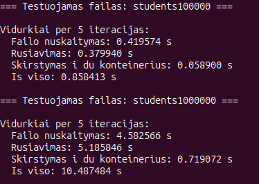

# Studentų valdymo programa

Tai C++17 projektas studentų duomenims nuskaityti, generuoti, rūšiuoti, skaidyti į dvi grupes ir išvesti į ekraną arba į failą. Programa palaiko kelis konteinerių tipus: `vector`, `list` ir `deque`.

## Funkcionalumas

- studentų įrašų nuskaitymas iš failo
- studentų kūrimas rankiniu būdu arba generuojant atsitiktinius duomenis
- galutinio pažymio skaičiavimas pagal vidurkį arba medianą
- studentų rūšiavimas pagal vardą, pavardę arba galutinį pažymį
- studentų skaidymas į `nuskriausti` ir `protingi`
- rezultatų išvedimas į ekraną arba į tekstinį failą
- testai didelėms duomenų imtims ir skirtingiems konteineriams

## Sistemos specifikacijos

Projektas buvo testuotas šioje aplinkoje:

| Paskirtis | Reikšmė |
| --- | --- |
| Operacinė sistema | Ubuntu 24.04.4 LTS |
| Branduolys | 6.17.0-20-generic |
| Kompiliatorius | g++ 13.3.0 |
| C++ standartas | C++17 |
| Procesorius | Intel Core i5-1035G1 @ 1.00 GHz |
| Operatyvioji atmintis | 7.3 GiB |
| Saugykla | SAMSUNG MZALQ256HAJD-000L2 NVMe SSD, 238.5 GB |

## Reikalavimai

- `g++` su C++17 palaikymu
- `make`

Greita patikra Linux aplinkoje:

```bash
g++ --version
make --version
```

## Kompiliavimas

1. Pereikite į projekto aplanką.
2. Surinkite programą su `make`.

```bash
cd /home/mantrimas/Documents/OOP/objektinis-programavimas
make
```

Tai sukuria vykdomąjį failą `student-vector`.

## Paleidimas

Paleiskite programą:

```bash
./student-vector
```

Išvalymas (jei reikia pilno perkompiliavimo):

```bash
make clean
```

Pilnas perkompiliavimas:

```bash
make clean && make
```

## Kaip paleisti našumo testus

Interaktyviame meniu pasirinkite:

1. `8 - Testuoti studentu skirstyma i nuskriaustus ir protingus`
2. Konteinerį:
	`1 - vector<Student>`
	`2 - list<Student>`
	`3 - deque<Student>`
3. Strategiją:
	`1 - Pirma`
	`2 - Antra`
	`3 - Trecia`

Testai paleidžiami failams:

- `students1000`
- `students10000`
- `students100000`
- `students1000000`
- `students10000000`

Programa pateikia laikus šioms dalims:

- failo nuskaitymas
- rūšiavimas
- skirstymas į `nuskriausti` ir `protingi`
- bendras laikas

## Testų rezultatai: `struct` ir `class`

Žemiau pateikti testai, kuriuose buvo lyginama, kaip programa veikia naudojant `struct` ir `class` studentų aprašymui.

### `struct`


### `class`



Pastaba: rezultatai priklauso nuo aparatinės įrangos, kompiliatoriaus versijos, disko spartos ir tuo metu veikiančių foninių procesų. Šiuose testuose naudoti failai `students100000` ir `students1000000`, o kiekvienas matavimas buvo vidurkinamas per 5 iteracijas.

## Išvados

Iš šių bandymų matyti, kad `struct` versija šiek tiek greičiau atliko abu testuotus scenarijus nei `class` versija. Skirtumas buvo matomas tiek failo nuskaitymo, tiek rūšiavimo, tiek bendro laiko rezultatuose.

Didėjant įvesčiai, skirtumas tarp abiejų variantų išliko pastebimas, tačiau didžiausią laiką vis tiek sudarė duomenų nuskaitymas ir rūšiavimas.

## Struktūra

- `include/` - antraštiniai failai
- `src/` - pagrindinis programos kodas
- `assets/` - projekto vaizdai
- `data/` - pradiniai duomenų failai
- `students1000`, `students10000`, `students100000`, `students1000000`, `students10000000` - didelių imčių failai bandymams

## Pastabos

- Programa naudoja `make` failą surinkimui.
- Rikiavimas veikia tiek su `vector`, tiek su `list`, tiek su `deque`.
- Didelių duomenų imčių testai skirti palyginti nuskaitymo, rūšiavimo ir skaidymo laikus.
